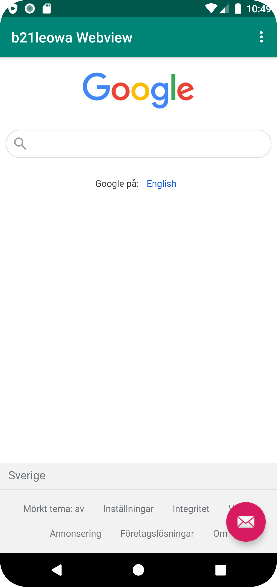
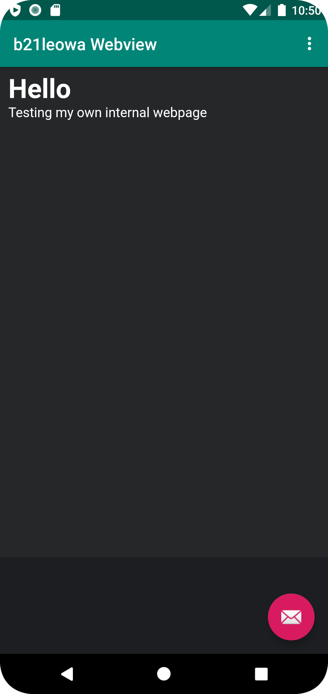

# Rapport

I renamed the App to b21leowa Webview, enabled the internet access in AndroidManifest.xml
Also added webview and added @+id/my_webview. Pushed it to my github repo.

Then i created a private myWebView in  MainActivity and located the myWebView with findViewById.
Then i created a new instance of WebViewClient and attached the myWebView to webViewClient.
Pushed it to my github repo.

I enabled the JavaScript by myWebView.getSettings().setJavaScriptEnabled(true)
 and added external url to load.myWebView. Pushed to my github repo.

Then i moved my loadUrl to the correct method and added my internalWebPage.
Then i called the methods into the onOptionsItemSelected and the internal- or externalWebPage opens.

 ```package com.example.webviewapp;

    import android.os.Bundle;
    import android.util.Log;
    import android.view.View;
    import android.view.Menu;
    import android.view.MenuItem;
    import android.webkit.WebView;
    import android.webkit.WebViewClient;

    import com.google.android.material.floatingactionbutton.FloatingActionButton;
    import com.google.android.material.snackbar.Snackbar;

    import androidx.appcompat.app.AppCompatActivity;
    import androidx.appcompat.widget.Toolbar;

    public class MainActivity extends AppCompatActivity {

        private WebView myWebView;

        public void showExternalWebPage(){
            myWebView.loadUrl("https://www.google.com");
        }

        public void showInternalWebPage(){
            myWebView.loadUrl("file:///android_asset/index.html");
        }

        @Override
        protected void onCreate(Bundle savedInstanceState) {
            super.onCreate(savedInstanceState);
            setContentView(R.layout.activity_main);
            Toolbar toolbar = findViewById(R.id.toolbar);
            setSupportActionBar(toolbar);
            myWebView = findViewById(R.id.my_webview);
            WebViewClient webViewClient = new WebViewClient();
            myWebView.setWebViewClient(webViewClient);
            myWebView.getSettings().setJavaScriptEnabled(true);

            FloatingActionButton fab = findViewById(R.id.fab);
            fab.setOnClickListener(new View.OnClickListener() {
                @Override
                public void onClick(View view) {
                    Snackbar.make(view, "Replace with your own action", Snackbar.LENGTH_LONG)
                            .setAction("Action", null).show();
                }
            });
        }

        @Override
        public boolean onCreateOptionsMenu(Menu menu) {
            // Inflate the menu; this adds items to the action bar if it is present.
            getMenuInflater().inflate(R.menu.menu_main, menu);
            return true;
        }

        @Override
        public boolean onOptionsItemSelected(MenuItem item) {
            // Handle action bar item clicks here. The action bar will
            // automatically handle clicks on the Home/Up button, so long
            // as you specify a parent activity in AndroidManifest.xml.
            int id = item.getItemId();

            //noinspection SimplifiableIfStatement
            if (id == R.id.action_external_web) {
                showExternalWebPage();
                return true;
            }

            if (id == R.id.action_internal_web) {
                showInternalWebPage();
                return true;
            }

            return super.onOptionsItemSelected(item);
        }
    }
```





